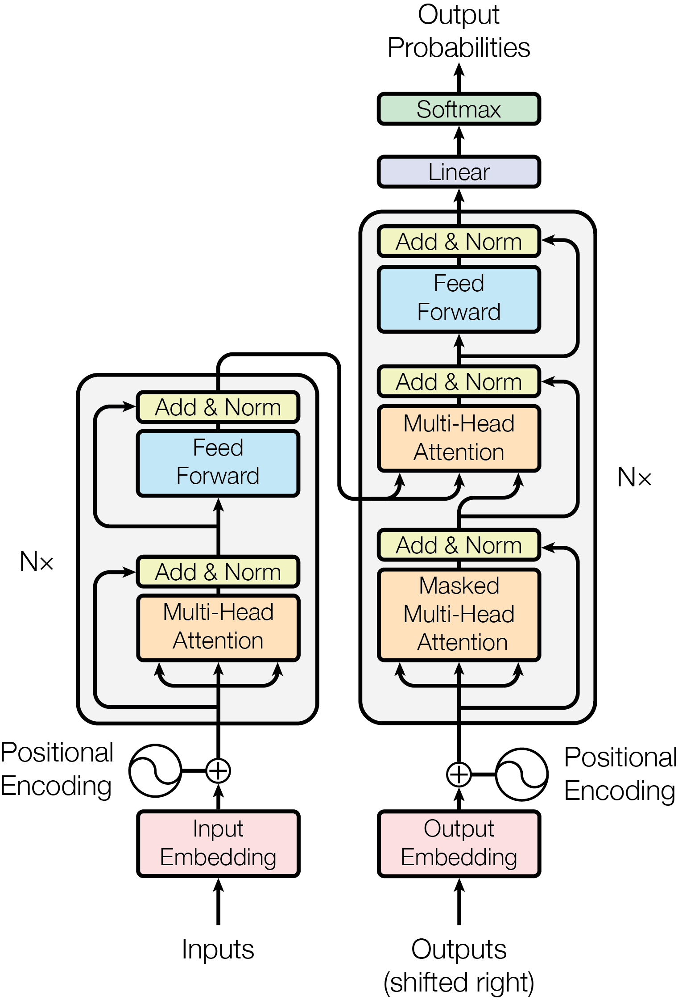

# Attention Is All You Need

## 什么是 Transformer？

Transformer 来自于一篇论文 Attention Is All You Need。Transformer 由两个部分组成：编码器和解码器。
编码器是六个相同的块。每层有两个子层，第一个是多头注意力机制，第二个是位置感知前馈神经网络，两个子层都使用残差连接，然后进行层归一化。
解码器也是六个相同的块。除了每个编码器层中的两个子层之外，解码器还插入了第三个子层。第三个子层对编码器块的输出执行多头注意力，然后残差连接和层归一化。同时对自注意力子层进行掩码处理，确保后续 token 被关注。

如图

## 什么是注意力？

缩放点积注意力的公式为：

$$Attention(Q,K,V)=softmax(\frac{QK^T}{\sqrt{d_k}})V$$

这里的 QKV 都是向量矩阵，Q 和 K 的维度都是$d_k$, V 的维度为$d_v$。
$\frac{1}{\sqrt{d_k}}$ 是缩放因子，防止因为点积之后数量级会增大，从而导致梯度极小。

说白了就是三个矩阵相乘，Q 和 K 具有相同的维度，但是 V 可以是其他维度，但是一般和他们相同。

QK 乘积表示的就是 token 之间的接近关系，一行的每个元素都是当前 token 发生之后，后面 token 发生的概率，这里 softmax 之后，就表示当前 token 之后，其他 token 的发生概率。但是感觉这里也可以是右上三角形呢？

## 什么是多头注意力？

多头注意力就是将维度拆分，计算多个注意力头，然后将注意力头合并，公式为：

$$
MultiHead(Q,K,V)=Concat(head_1,...,head_h)W^0 \\
head_i=Attention(QW_i^Q,KW_i^K,VW_i^V)
$$

论文中的维度是$d_model=512$，拆分成八个头，也就是$h=8$,这里的$d_k=d_v=d_model/h=64$

## 什么是位置感知前馈神经网络？

位置感知前馈神经网络的公式为：

$$FFN(x)=max(0, W_1+b_1)W_2+b_2$$

就是两个线性层中间使用 ReLU 激活，虽然输出输出的维度都是 512，但是中间的维度是 2048，也就是 4 倍。

## 什么是 embedding？

在语句序列被划分成 token 之后，将每个 token 转换成$d_model$维度的向量，就是 embedding。

## 什么是位置编码？

我们的输出是 tokens 在 embedding 之后的 embeddings 矩阵，但是 embeddings 矩阵无法表示相同 token 之间位置的区别，所以会为它加上一个同样大小的矩阵，这个矩阵就是位置编码后的矩阵，公式为：

$$
PE_{(pos,2i)} = sin(pos/10000^{2i/d_{model}})\\
PE_{(pos,2i+1)} = cos(pos/10000^{2i/d_{model}})
$$

公式原理就不太懂

## 使用什么优化器？

使用的是 Adam 优化器，公式为：

$$
lrate = d_{model}^{-0.5} \cdot min(step_num^{-0.5}, step_num*warmup_steps^{-1.5})
$$

## 使用什么正则化手段？

使用了三种正则化手段

- 残差 dropout
- 标签平滑

## 什么是残差连接？

假设原来的输出为 x，残差连接就是将以这个 x 输入到注意力层之后，我们将两者相加得到新的 x，也就是$x = x + Attention(x)$,同理，在 FFN 之后，也是$x = x + FFN(x)$。

## 什么是层归一化？

## 什么是掩码处理？

掩码处理就是在自注意力处理的时候乘以一个左下三角矩阵，实现的效果就是让模型认为后面的 token 信息是不知道的。

## 小结

transformer 的知识点

- 编码器和掩码器
- 自注意力和多头注意力
- 位置感知 FFN
- 残差连接
- 层归一化
- 掩码
- embedding
