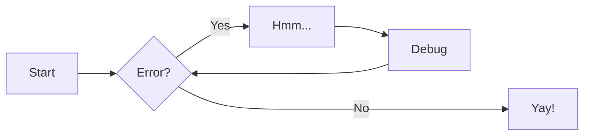
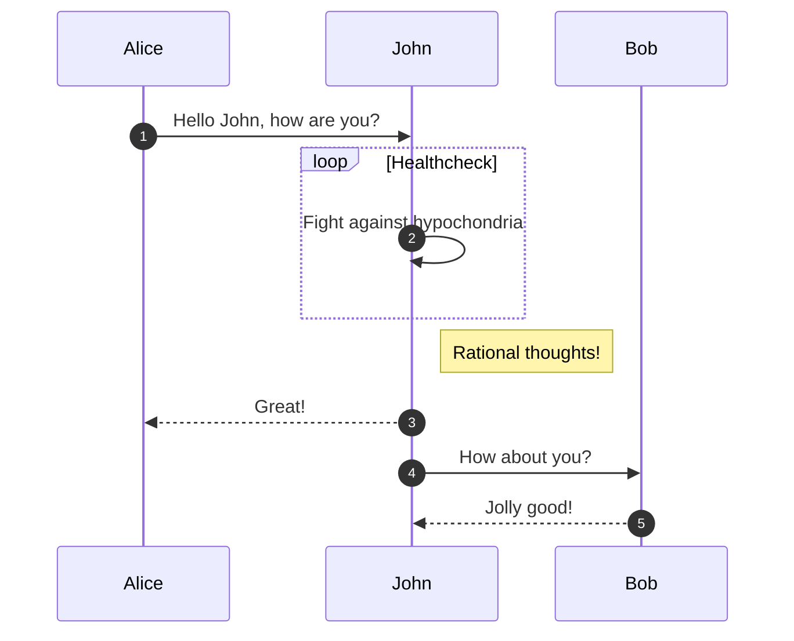
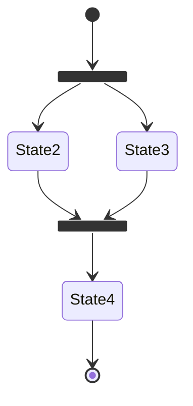
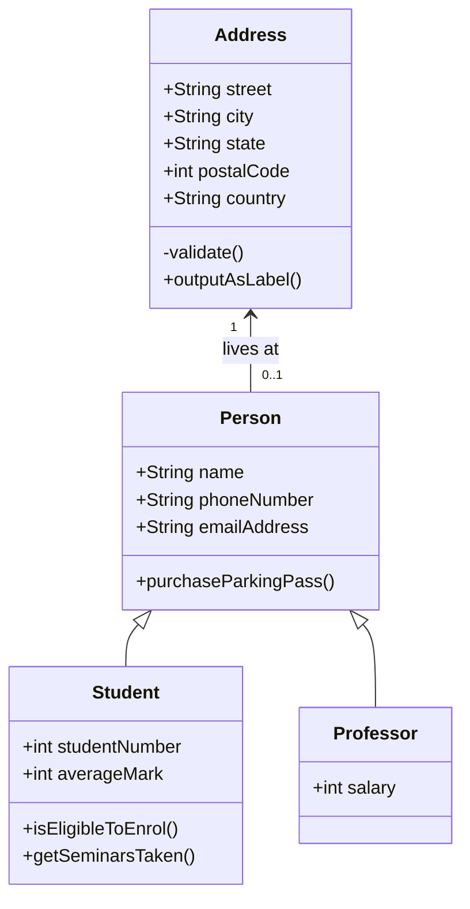
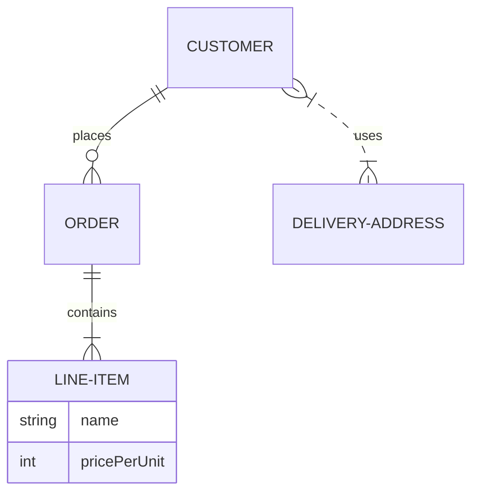

# markdown

Markdown 有很多的方言，mkdocs 支持了基本的 Markdown 语法，而`material for mkdocs` 支持更多的语法。基本的 markdown 语法参考[这里](https://daringfireball.net/projects/markdown/syntax),本文只记录一些特殊的 markdown 语法和[mkdocs](https://squidfunk.github.io/mkdocs-material/reference/)的拓展语法。

- [x] 特殊 markdown
- [x] Admonititions
- [ ] Annotations
- [ ] Buttons
- [ ] Code blocks
- [ ] Content tabs
- [ ] Data tables
- [ ] Diagrams
- [ ] Footnotes
- [ ] Grids
- [ ] Icons, Emojis
- [ ] Images
- [ ] Lists
- [ ] Math
- [ ] Tooltips

## 特殊 markdown

### 折叠内容

```html
<details>
  <summary>点击查看 python 代码</summary>

  ```python
  def greet(name):
    return f"hello {name}"

  print(greet("world))
  ```

</details>
```

<details>
  <summary>点击查看 python 代码</summary>

  ```python
  def greet(name):
    return f"hello {name}"

  print(greet("world))
  ```

</details>

如果需要默认展开，在 `details` 标签中添加 `open` 属性即可。

```html
<details open>
  <summary>点击查看 python 代码</summary>

  ```python
  def greet(name):
    return f"hello {name}"

  print(greet("world))
  ```

</details>
```

<details open>
  <summary>点击查看 python 代码</summary>

  ```python
  def greet(name):
    return f"hello {name}"

  print(greet("world))
  ```

</details>

这个代码在 `material for mkdocs` 中的渲染效果是 `Admonition` 的效果

### html 标签波浪线问题

因为 markdown 的规范中默认是不应该有 `html` 标签，但是如果要在 `markdown` 中使用 `html` 标签，需要在项目根目录下创建一个`.markdownlint.json` 文件。

```json
{
  "MD033": false
}
```

### 脚注

代码

```markdown
这是一个[脚注][1] 效果

[1]: https://www.example.com
```

效果

这是一个[脚注][1] 效果

[1]: https://www.example.com

## admonitions

### 基本提醒

```
!!! note

    Lorem ipsum dolor sit amet, consectetur adipiscing elit. Nulla et euismod
    nulla. Curabitur feugiat, tortor non consequat finibus, justo purus auctor
    massa, nec semper lorem quam in massa.
```

!!! note

    Lorem ipsum dolor sit amet, consectetur adipiscing elit. Nulla et euismod
    nulla. Curabitur feugiat, tortor non consequat finibus, justo purus auctor
    massa, nec semper lorem quam in massa.

这是一些支持的关键词

- note 
- abstract
- info
- tip 
- success
- question 
- warning
- failure
- danger
- bug
- example

### 嵌套提醒

```
!!! note "Outer Note"

    Lorem ipsum dolor sit amet, consectetur adipiscing elit. Nulla et euismod
    nulla. Curabitur feugiat, tortor non consequat finibus, justo purus auctor
    massa, nec semper lorem quam in massa.

    !!! note "Inner Note"

        Lorem ipsum dolor sit amet, consectetur adipiscing elit. Nulla et euismod
        nulla. Curabitur feugiat, tortor non consequat finibus, justo purus auctor
        massa, nec semper lorem quam in massa.
```

!!! note "Outer Note"

    Lorem ipsum dolor sit amet, consectetur adipiscing elit. Nulla et euismod
    nulla. Curabitur feugiat, tortor non consequat finibus, justo purus auctor
    massa, nec semper lorem quam in massa.

    !!! note "Inner Note"

        Lorem ipsum dolor sit amet, consectetur adipiscing elit. Nulla et euismod
        nulla. Curabitur feugiat, tortor non consequat finibus, justo purus auctor
        massa, nec semper lorem quam in massa.

### 无标题提醒

```
!!! note ""

    Lorem ipsum dolor sit amet, consectetur adipiscing elit. Nulla et euismod
    nulla. Curabitur feugiat, tortor non consequat finibus, justo purus auctor
    massa, nec semper lorem quam in massa.
```

!!! note ""

    Lorem ipsum dolor sit amet, consectetur adipiscing elit. Nulla et euismod
    nulla. Curabitur feugiat, tortor non consequat finibus, justo purus auctor
    massa, nec semper lorem quam in massa.

### 默认折叠的提醒

就是把感叹号替换成问号

```
??? note

    Lorem ipsum dolor sit amet, consectetur adipiscing elit. Nulla et euismod
    nulla. Curabitur feugiat, tortor non consequat finibus, justo purus auctor
    massa, nec semper lorem quam in massa.
```

??? note

    Lorem ipsum dolor sit amet, consectetur adipiscing elit. Nulla et euismod
    nulla. Curabitur feugiat, tortor non consequat finibus, justo purus auctor
    massa, nec semper lorem quam in massa.

### 行内提醒

添加 inline end 在右侧显示提醒框，使用 inline 在左侧显示提醒框

```
!!! info inline end "Lorem ipsum"

    Lorem ipsum dolor sit amet, consectetur
    adipiscing elit. Nulla et euismod nulla.
    Curabitur feugiat, tortor non consequat
    finibus, justo purus auctor massa, nec
    semper lorem quam in massa.
```

```
!!! info inline "Lorem ipsum"

    Lorem ipsum dolor sit amet, consectetur
    adipiscing elit. Nulla et euismod nulla.
    Curabitur feugiat, tortor non consequat
    finibus, justo purus auctor massa, nec
    semper lorem quam in massa.
```

## 给代码添加标题

代码

~~~markdown
```py title="bubble_sort.py"
def bubble_sort(items):
    for i in range(len(items)):
        for j in range(len(items) - 1 - i):
            if items[j] > items[j + 1]:
                items[j], items[j + 1] = items[j + 1], items[j]
```
~~~

这个效果只能在 `material for mkdocs` 中使用。

```py title="bubble_sort.py"
def bubble_sort(items):
    for i in range(len(items)):
        for j in range(len(items) - 1 - i):
            if items[j] > items[j + 1]:
                items[j], items[j + 1] = items[j + 1], items[j]
```

---

1. :man_raising_hand: I'm a code annotation! I can contain `code`, **formatted
    text**, images, ... basically anything that can be written in Markdown.

剥离注释

```yaml
# (1)!
```

1. Look ma, less line noise!

添加行号

```py linenums="1"
def bubble_sort(items):
    for i in range(len(items)):
        for j in range(len(items) - 1 - i):
            if items[j] > items[j + 1]:
                items[j], items[j + 1] = items[j + 1], items[j]
```

高亮行

```py hl_lines="2 3"
def bubble_sort(items):
    for i in range(len(items)):
        for j in range(len(items) - 1 - i):
            if items[j] > items[j + 1]:
                items[j], items[j + 1] = items[j + 1], items[j]
```

## tab

=== "C"

    ``` c
    #include <stdio.h>

    int main(void) {
      printf("Hello world!\n");
      return 0;
    }
    ```

=== "C++"

    ``` c++
    #include <iostream>

    int main(void) {
      std::cout << "Hello world!" << std::endl;
      return 0;
    }
    ```

=== "python"

    ``` python
    print("Hello world!")
    ```

根据其他内容分组

=== "Unordered list"

    * Sed sagittis eleifend rutrum
    * Donec vitae suscipit est
    * Nulla tempor lobortis orci

=== "Ordered list"

    1. Sed sagittis eleifend rutrum
    2. Donec vitae suscipit est
    3. Nulla tempor lobortis orci

嵌入式 tab

???+ example

    === "Unordered List"

        ``` markdown
        * Sed sagittis eleifend rutrum
        * Donec vitae suscipit est
        * Nulla tempor lobortis orci
        ```

    === "Ordered List"

        ``` markdown
        1. Sed sagittis eleifend rutrum
        2. Donec vitae suscipit est
        3. Nulla tempor lobortis orci
        ```

## 表格

| Method   | Description                          |
| -------- | ------------------------------------ |
| `GET`    | :material-check: Fetch resource      |
| `PUT`    | :material-check-all: Update resource |
| `DELETE` | :material-close: Delete resource     |

对齐列

=== "Left"

    | Method   | Description                          |
    | :------- | :----------------------------------- |
    | `GET`    | :material-check:     Fetch resource  |
    | `PUT`    | :material-check-all: Update resource |
    | `DELETE` | :material-close:     Delete resource |

=== "Center"

    |  Method  |             Description              |
    | :------: | :----------------------------------: |
    |  `GET`   | :material-check:     Fetch resource  |
    |  `PUT`   | :material-check-all: Update resource |
    | `DELETE` | :material-close:     Delete resource |

=== "Right"

    |   Method |                          Description |
    | -------: | -----------------------------------: |
    |    `GET` |  :material-check:     Fetch resource |
    |    `PUT` | :material-check-all: Update resource |
    | `DELETE` | :material-close:     Delete resource |

导入 csv 文件

...

{{ read_csv('./data.csv') }}

...

## 图表

flowchat



序列图



状态图



类图



实体关系图



## 脚注

```title="footnote"
Lorem ipsum[^1] dolor sit amet, consectetur adipiscing elit.[^2]

[^1]: Lorem ipsum dolor sit amet, consectetur adipiscing elit.

[^2]:
    Lorem ipsum dolor sit amet, consectetur adipiscing elit. Nulla et euismod
    nulla. Curabitur feugiat, tortor non consequat finibus, justo purus auctor
    massa, nec semper lorem quam in massa.
```

## 格式化

Text can be {--deleted--} and replacement text {++added++}. This can also be
combined into {~~one~>a single~~} operation. {==Highlighting==} is also
possible {>>and comments can be added inline<<}.

{==

Formatting can also be applied to blocks by putting the opening and closing
tags on separate lines and adding new lines between the tags and the content.

==}

高亮文本

- ==This was marked==
- ^^This was inserted^^
- ~~This was deleted~~

角标

- H~2~O
- A^T^A

键盘按键

++ctrl+alt+del++

## 图像

    ``` title = "image"

    { align=left }

    ```

添加图像名称

<figure markdown>
  { width="300" }
  <figcaption>Image caption</figcaption>
</figure>

## 公式

$$
\operatorname{ker} f=\{g\in G:f(g)=e_{H}\}{\mbox{.}}
$$

行内公式

The homomorphism $f$ is injective if and only if its kernel is only the
singleton set $e_G$, because otherwise $\exists a,b\in G$ with $a\neq b$ such
that $f(a)=f(b)$.

## tooltips

[Hover me](https://example.com "I'm a tooltip!")

添加到链接

[Hover me][example]

[example]: https://example.com "I'm a tooltip!"

添加到图标

:material-information-outline:{ title="Important information" }

添加缩写

The HTML specification is maintained by the W3C.

_[HTML]: Hyper Text Markup Language
_[W3C]: World Wide Web Consortium
